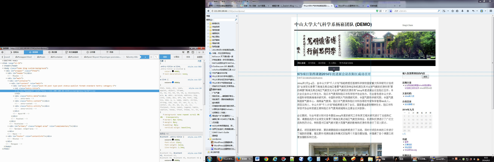

* content
{:toc}

杨老师网站要求wordpress主题模板采用浮动框的形式显示内容。类似学校网站http://www.sysu.edu.cn/2012/cn/index.htm这种组织形式，搜索半天，似乎没有类似主题，没办法，这个只能自己动手丰衣足食了，无奈对wordpress主题php及css组织结构毫无概念，请教俊文大概了解实现方向后只得从基础开始学起。这里算是个笔记吧。
<h4>模板文件及工作流程</h4>
一套完整的WordPress模版应至少包括如下文件：
<blockquote>

style.css : 样式表文件
index.php : 首页模板
archive.php : 文章归档/分类目录模板
404.php : 404 模板
comments.php : 留言/回复模板
footer.php : 底部模板
header.php : 顶部模板
sidebar.php : 侧栏模板
page.php : 页面模板
single.php : 文章页面模板
functions.php : 模板函数
search.php : 搜索结果模板

</blockquote>
模板文件的工作机制如下图所示，可以看到每当有WordPress页面（你愿意额话可以称之为WordPress引擎）被调用时，它会判断（通过排除法）页面的类型。 这类似于询问“我在哪儿？”。 WordPress回答“我在…类型的页面上”，然后以特定顺序调用页面。 WordPress找不到需要的PHP文件时，会使用“index.php”文件来代替所需文件。

对应的基本加载流程如下：
<h6>1. 调用页眉
2. 开启the loop（主循环）
3. 调用永久链接与一些网页上的meta
4. 调用以通知WordPress该获取的信息
5. 调用以获取获取文章内容或摘要
6. （或许）更多的meta
7. 关闭the loop（主循环）
8. 调用侧边栏
9. 调用页脚</h6>
这里主要介绍一下循环调用数据库the loop（主循环）
“WordPress Loop”会在数据库中持续调用文件，直到WordPress终止调用。 “the loop”的结构随显示页面类型而变，WordPress尝试加载的每个基本类型页面都有一个“loop”。 下面是开启the loop的代码：
<strong>&lt;?php if ( have_posts() ) : &lt;?php if ( have_posts() ) : the_post(); ?&gt; </strong>

我们可以看到，代码被拆分开来，have_posts用以定义条件标签，while和the_post则各成一部分，但这仍然是the loop，在所有页面中基本都是这样。 多行loop时的一个用法是：用query_posts在“if have_posts”和代码的剩余部分之间放置一个参数，用来显示单篇文章、某一时段的文章、最近一篇文章或者某一类别中的文章，也可以改变the loop中迭代文章的顺序

在修改模板的过程中，firefox的开发者工具非常好用，下图可以看到，配合双屏，开发者工具能够快速定位元素在代码流中的位置，并且锁定css选择器等，而且拥有实时修改测试的沙盒功能。

参考资料：

http://blog.sina.com.cn/s/blog_a02d97db0101d2b0.html

http://www.2cto.com/kf/201209/154009.html

http://webbeta.org/2009/05/21/how-to-hack-wordpress-theme-template-pages/（讲解加载流程）