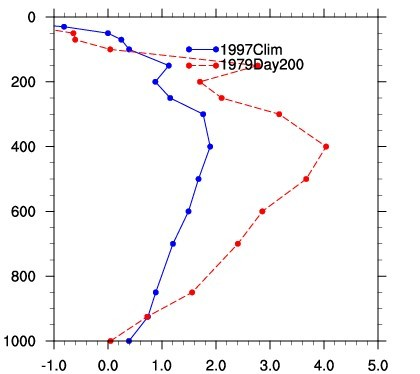

* content
{:toc}

NCL v6.3.0发布后，发现新增了advect_variable函数，这对于一些复杂诊断方程的计算无疑非常方便，于是决定用ncl来计算Q1.没想到advect_variable函数与垂直积分函数一样，运行后告诉我找不到这个函数，这什么情况，新feature没加好就发布还说有了有了……坑爹啊。

后来用<a href="http://www.ncl.ucar.edu/Document/Functions/Built-in/center_finite_diff_n.shtml">center_finite_diff_n</a>中央差分函数配合完成，计算效率感觉比之前错误得用EC monthly数据算时高非常多（主要是short2flt函数慢），何况NCEP-DOE这套资料还是daily，1度和2.5度分辨率差这么多？没仔细算数据规模，不知道为什么……

写程序时基本没有出什么错误，对这类诊断方程编程时，最需要注意的就是统一国际单位制，量纲要分析正确。还有平流项是严重的非线性项，一定要用daily算再平均到monthly哦～

第一次出图，1979年年均菲律宾海一带Q1与Day200时的Q1，一看就是对的吧:-)

