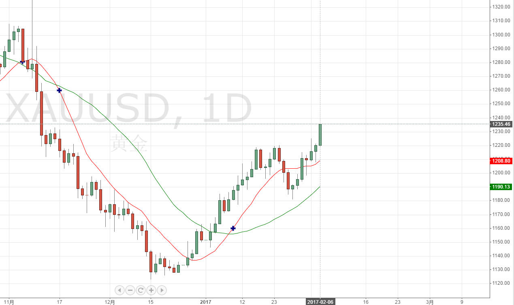

* content
{:toc}

#170206

30日均线在17年初反转，12日均线持续在30日均线上方。趋势持续？工行多单浮盈近2%，设了上下2元双向挂单。<strong>如趋势持续涨过274元，计划存金宝出1/3（4000元），用于空单投机。</strong>

应该做日尺度上的小波分析，确定关注几日尺度的MA技术指标。

#170208

昨日横盘良久，开了少量美元空单并设置止损（<strong>没有遵循274线！</strong>），没想到当晚就被止损，国际金涨到1240上方。国内现货也到276，但工行纸黄金没有跟涨！少量白银已挂止损单。存金宝计划卖出7g。33g多头继续持仓（抗浮盈）。2g纸黄金抗浮盈。趋势似乎不会轻易反转，适当减仓后，继续持仓持现观望，<strong>做空要慎重！</strong>